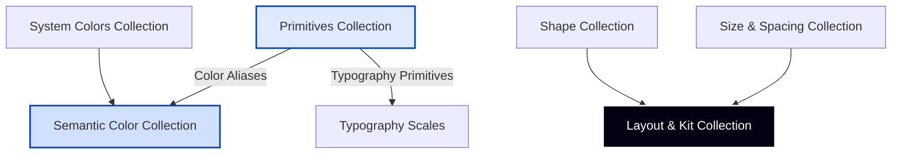

# QuGenie Variable-First Design System Documentation

Welcome to the definitive source of truth for the QuGenie brand design system. This document outlines the variable-first design framework, bridging the gap between Figma's Local Variables (multi-theme SDS modes) and active Tailwind CSS v4.0 / React Motion code.

---

## 📐 Design System Architecture

Our design system is structured into **12 Figma Local Variable Collections**, grouped by their functional primitives, semantic definitions, component kits, and layout systems.



---

## 🗂️ Figma Variable Collections Overview

| Collection Name | Variable Count | Core Purpose |
| :--- | :--- | :--- |
| **`Shape`** | 8 tokens | Corner radii, border weights, and element curvature |
| **`Colors`** | 79 tokens | Functional semantic aliases (Backgrounds, Borders, Overlays) |
| **`Icons`** | 1 token | Icon sizing bounds and stroke thickness |
| **`Kit`** | 19 tokens | Component-level layouts (e.g., Stacking Cards offsets) |
| **`App Icon Modes`** | 1 token | Dark/Light state mapping for the main app logo |
| **`System Colors`** | 22 tokens | Status colors (Success, Warning, Danger/Error, Info) |
| **`Color`** | 136 tokens | Multi-theme Text/Foreground variables (Light & Dark modes) |
| **`Color Primitives`**| 20 tokens | Base palette scale definitions (`Slate/*` and `Brand/*` swatches) |
| **`Responsive`** | 4 tokens | Media query layouts and viewport breakpoints |
| **`Size`** | 41 tokens | Base spacing scale and container dimensions |
| **`Typography`** | 35 tokens | Component typographic hierarchy pairings |
| **`Typography Primitives`**| 31 tokens | Base font weight weights, size values, and line-heights |

---

## 🎨 Collections 1 & 2: Colors & Color Primitives
### Multi-Theme Semantic Mapping (`SDS Light` vs `SDS Dark`)

Our core text and brand tokens map dynamically depending on the current theme mode, aliased directly from primitive scales (`Slate` and `Brand`).

### 1. Neutral Text/Foreground Tokens
These handle all readability scales for headings, body, descriptions, and structural text on neutral backgrounds.

| Semantic Token Name | SDS Light Value | SDS Dark Value | Hex Equivalent (Light / Dark) | Usage |
| :--- | :--- | :--- | :--- | :--- |
| **`Secondary`** | `Slate/700` | `Slate/300` | `#384250` / `#D2D6DB` | Paragraph text, sub-descriptions |
| **`Tertiary`** | `Slate/600` | `Slate/400` | `#4D5761` / `#9DA4AE` | Secondary labels, timestamps |
| **`On Neutral`** | `Slate/100` | `Slate/950` | `#F3F4F6` / `#0D121C` | Inverted element items |
| **`On Neutral Secondary`**| `Slate/900` | `Slate/100` | `#111927` / `#F3F4F6` | Dark active text / Light dark active |
| **`On Neutral Tertiary`** | `Slate/800` | `Slate/100` | `#1F2A37` / `#F3F4F6` | Subdued dark neutral elements |

### 2. Brand Text/Foreground Tokens (`Text / Brand`)
These drive QuGenie's brand presence through typography accents, indicators, and primary labels.

| Semantic Token Name | SDS Light Value | SDS Dark Value | Hex Equivalent (Light / Dark) | Usage |
| :--- | :--- | :--- | :--- | :--- |
| **`Default`** | `Brand/800` | `Brand/300` | `#0040C1` / `#84ADFF` | Primary link items, main CTAs |
| **`Secondary`** | `Brand/600` | `Brand/400` | `#155EEF` / `#528BFF` | Secondary text buttons, hover highlights |
| **`Tertiary`** | `Brand/500` | `Brand/100` | `#2970FF` / `#D1E0FF` | Disabled brand states, accent markers |

### 3. Semantic Background Tokens (`Background`)
These drive structural backdrops, canvas grids, panels, hover highlights, and neutral card offsets in light & dark modes.

| Semantic Group | Token Sub-Name | SDS Light Value | SDS Dark Value | Hex Equivalent (Light / Dark) | Usage |
| :--- | :--- | :--- | :--- | :--- | :--- |
| **`Background / Default`** | `Default` | `White/1000` | `Gray/900` | `#FFFFFF` / `#141414` | Primary page & container canvas |
| | `Default Hover` | `Gray/100` | `Gray/700` | `#F5F5F5` / `#424242` | Primary background hover state |
| | `Secondary` | `Gray/100` | `Gray/800` | `#F5F5F5` / `#292929` | Alternating section backdrops, sub-groups |
| | `Secondary Hover` | `Gray/200` | `Gray/900` | `#E5E5E5` / `#141414` | Secondary background hover state |
| | `Tertiary` | `Gray/300` | `Gray/600` | `#D6D6D6` / `#525252` | Deeper layout bounds |
| | `Tertiary Hover` | `Gray/400` | `Gray/700` | `#A3A3A3` / `#424242` | Tertiary background hover state |
| **`Background / Neutral`** | `Default` | `Slate/700` | `Slate/400` | `#384250` / `#9DA4AE` | Inverted background blocks |

---

### 🎨 Primitive Color Scales (100–950 Scales)

Our primitive scales provide raw hex values which map directly into semantic tokens.

````carousel
```python
# Primary Brand Blue scale (Figma Primitives)
brand_primitives = {
    25:  "#F5F8FF",  # Soft background tint
    50:  "#EFF4FF",
    100: "#D1E0FF",
    200: "#B2CCFF",  # Dropdown borders
    300: "#84ADFF",
    400: "#528BFF",
    500: "#2970FF",
    600: "#155EEF",
    700: "#004EEB",
    800: "#0040C1",  # Primary Action Brand Color
    900: "#00359E",
    950: "#002266"   # Deepest warm blue
}
```
<!-- slide -->
```python
# Neutral Slate Primitive Scale (Figma Primitives)
gray_primitives = {
    25:  "#FCFCFD",
    50:  "#F9FAFB",
    100: "#F3F4F6",
    200: "#E5E7EB",
    300: "#D2D6DB",
    400: "#9DA4AE",
    500: "#6C737F",
    600: "#4D5761",  # Standard secondary body gray
    700: "#384250",
    800: "#1F2A37",
    900: "#111927",  # Primary headings dark slate
    950: "#0D121C"
}
```
<!-- slide -->
```python
# Semantic Status Alerts
alert_primitives = {
    "success_100": "#D1FADF", "success_600": "#039855", # Green
    "danger_100": "#FEE4E2",  "danger_600": "#D92D20",  # Red/Rose
    "warning_100": "#FEF0C7", "warning_600": "#DC6803"  # Orange/Amber
}
```
````

---

## 📐 Collection 3: Shape Tokens

These manage curvature and element boundaries to ensure physical layout consistency.

| Figma Token | CSS Variable / Tailwind | Value | Standard Application |
| :--- | :--- | :--- | :--- |
| `border-radius/sm` | `rounded-sm` | `4px` | Minimal rounding, small checkbox indicators |
| `border-radius/md` | `rounded-md` | `8px` | Buttons, input fields, badges |
| `border-radius/lg` | `rounded-lg` | `12px` | Dropdown panels, card hover overlays |
| `border-radius/xl` | `rounded-xl` | `20px` | Large container cards (e.g. Stacking Cards, About Us Card) |

---

## 📏 Collection 4: Size & Spacing Spacing System

QuGenie utilizes a **4px base unit grid**. All spacing, margins, paddings, and structural gaps use increments of this base grid.

```
Base Unit = 4px
Scale Factor = 1x, 2x, 3x, 4x, 5x, 6x, 8x, 10x, 12x, 16x...
```

| Spacing Token | Pixels | REM | Tailwind Class | Application |
| :--- | :--- | :--- | :--- | :--- |
| `spacing/1` | `4px` | `0.25rem` | `p-1` / `gap-1` | Micro labels, badge gaps |
| `spacing/2` | `8px` | `0.5rem` | `p-2` / `gap-2` | Icon + Text spacing, item sub-groups |
| `spacing/3` | `12px` | `0.75rem` | `p-3` / `gap-3` | Button inner padding, header small gaps |
| `spacing/4` | `16px` | `1rem` | `p-4` / `gap-4` | Base layout unit, menu item lists |
| `spacing/5` | `20px` | `1.25rem` | `p-5` / `gap-5` | Card interior padding limits |
| `spacing/6` | `24px` | `1.5rem` | `p-6` / `gap-6` | Hero spacing sections |
| `spacing/8` | `32px` | `2rem` | `p-8` / `gap-8` | Section inner cards padding, layout groups |
| `spacing/10` | `40px` | `2.5rem` | `p-10` / `gap-10` | Nav list offsets, Stacking Cards gap offsets |
| `spacing/12` | `48px` | `3rem` | `p-12` / `gap-12` | Major grid separators |
| `spacing/16` | `64px` | `4rem` | `py-16` | Standard section vertical padding |
| `spacing/20` | `80px` | `5rem` | `py-20` | Hero and Footer edge padding |

---

## 📱 Collection 5: Responsive & Viewport Breakpoints

Four responsive layout breakpoint variables dictate all media queries in the system.

| Breakpoint | Figma Variable Value | Responsive Targeting | Width Behavior |
| :--- | :--- | :--- | :--- |
| **`sm`** | `375px` | Mobile Portability | Stack elements, padding limit 16px |
| **`md`** | `768px` | Tablet Screens | Grid items go to 2-columns |
| **`lg`** | `1280px` | Standard Desktop | Full container grid system (12 columns) |
| **`xl`** | `1440px` | Wide Screens | Maximum canvas bound |

---

## 📝 Collection 6: Typography Systems

QuGenie is set in the premium grotesque sans-serif **Neue Montreal** font family across headings, bodies, navigation, and interface components.

### 1. Typography Primitives (Size, Line Height, Weights)
*   **Font Weights**: `Regular` (400), `Medium` (500), `Semi_Bold` (600), `Bold` (700)
*   **Default Scale**:

| Name | Size (px) | Line Height (px) | Tracking | Standard Purpose |
| :--- | :--- | :--- | :--- | :--- |
| **Display 2xl**| `72px` | `90px` | `-2%` | Large hero statements |
| **Display lg** | `48px` | `60px` | `-2%` | Main section headings |
| **Display md** | `36px` | `44px` | `-2%` | Subsections & card group titles |
| **Display xs** | `24px` | `32px` | `0` | Individual item cards |
| **Text xl** | `20px` | `30px` | `0` | Lead subtitles & blockquotes |
| **Text lg** | `18px` | `28px` | `0` | High-importance descriptions |
| **Text md** | `16px` | `24px` | `0` | Standard body copy, nav text, buttons |
| **Text sm** | `14px` | `20px` | `0` | Captions, small label lists |

---

## ⚙️ CSS & Tailwind CSS v4.0 Implementation Guide

Here is the exact `@theme` declaration representing this design system in your project. Add this directly in `src/styles/theme.css` to consume these tokens in classes.

```css
@custom-variant dark (&:is(.dark *));

:root {
  /* Primitive Brand Blue Scale Definitions */
  --brand-25: #F5F8FF;
  --brand-50: #EFF4FF;
  --brand-100: #D1E0FF;
  --brand-200: #B2CCFF;
  --brand-300: #84ADFF;
  --brand-400: #528BFF;
  --brand-500: #2970FF;
  --brand-600: #155EEF;
  --brand-700: #004EEB;
  --brand-800: #0040C1;
  --brand-900: #00359E;
  --brand-950: #002266;

  /* Primitive Slate Scale Definitions */
  --slate-25: #FCFCFD;
  --slate-50: #F9FAFB;
  --slate-100: #F3F4F6;
  --slate-200: #E5E7EB;
  --slate-300: #D2D6DB;
  --slate-400: #9DA4AE;
  --slate-500: #6C737F;
  --slate-600: #4D5761;
  --slate-700: #384250;
  --slate-800: #1F2A37;
  --slate-900: #111927;
  --slate-950: #0D121C;

  /* Theme-aware QuGenie Colors (Light Mode) */
  --background: #ffffff;
  --foreground: #0d0d0d;
  --card: #ffffff;
  --card-foreground: #0d0d0d;
  --popover: #ffffff;
  --popover-foreground: #0d0d0d;
  
  --primary: var(--brand-800);
  --primary-foreground: #ffffff;
  
  --secondary: var(--slate-50);
  --secondary-foreground: var(--slate-700);
  
  --muted: var(--slate-100);
  --muted-foreground: var(--slate-500);
  
  --accent: var(--brand-100);
  --accent-foreground: var(--brand-600);
  
  --destructive: #d92d20;
  --destructive-foreground: #ffffff;
  
  --border: var(--slate-200);
  --input: var(--slate-300);
  --ring: var(--brand-300);

  /* Radius & Size variables */
  --radius-sm: 4px;
  --radius-md: 8px;
  --radius-lg: 12px;
  --radius-xl: 20px;
}

.dark {
  /* Theme-aware QuGenie Colors (Dark Mode) */
  --background: #080411;
  --foreground: #fcfcfd;
  --card: #080411;
  --card-foreground: #fcfcfd;
  --popover: #080411;
  --popover-foreground: #fcfcfd;
  
  --primary: var(--brand-800);
  --primary-foreground: #ffffff;
  
  --secondary: var(--slate-800);
  --secondary-foreground: var(--slate-200);
  
  --muted: var(--slate-900);
  --muted-foreground: var(--slate-400);
  
  --accent: var(--brand-950);
  --accent-foreground: var(--brand-300);
  
  --destructive: #d92d20;
  --destructive-foreground: #ffffff;
  
  --border: var(--slate-700);
  --input: var(--slate-600);
  --ring: var(--brand-300);
}

@theme inline {
  --color-background: var(--background);
  --color-foreground: var(--foreground);
  --color-card: var(--card);
  --color-card-foreground: var(--card-foreground);
  --color-popover: var(--popover);
  --color-popover-foreground: var(--popover-foreground);
  
  --color-primary: var(--primary);
  --color-primary-foreground: var(--primary-foreground);
  
  --color-secondary: var(--secondary);
  --color-secondary-foreground: var(--secondary-foreground);
  
  --color-muted: var(--muted);
  --color-muted-foreground: var(--muted-foreground);
  
  --color-accent: var(--accent);
  --color-accent-foreground: var(--accent-foreground);
  
  --color-destructive: var(--destructive);
  --color-destructive-foreground: var(--destructive-foreground);
  
  --color-border: var(--border);
  --color-input: var(--input);
  --color-ring: var(--ring);

  --radius-sm: var(--radius-sm);
  --radius-md: var(--radius-md);
  --radius-lg: var(--radius-lg);
  --radius-xl: var(--radius-xl);

  --color-brand-25: var(--brand-25);
  --color-brand-50: var(--brand-50);
  --color-brand-100: var(--brand-100);
  --color-brand-200: var(--brand-200);
  --color-brand-300: var(--brand-300);
  --color-brand-400: var(--brand-400);
  --color-brand-500: var(--brand-500);
  --color-brand-600: var(--brand-600);
  --color-brand-700: var(--brand-700);
  --color-brand-800: var(--brand-800);
  --color-brand-900: var(--brand-900);
  --color-brand-950: var(--brand-950);
}
```

---

## 🎬 Premium Interactions & Micro-Animations

To ensure the design feels responsive, cohesive, and state-of-the-art, consume these motion guidelines:

### 1. Stacking Card Offsets (Collection: `Kit`)
Stacking cards use an incremental offset system inside scroll bounds:
```tsx
const cardRef = useRef<HTMLDivElement>(null);
const { scrollYProgress } = useScroll({
  target: cardRef,
  offset: ["start end", "end start"]
});

// Card index offsets increment by 40px
const scale = useTransform(scrollYProgress, [0, 0.3, 0.65, 1], [0.95, 1, 1 - index * 0.05, 1 - index * 0.05]);
const opacity = useTransform(scrollYProgress, [0, 0.3, 0.65, 1], [0.8, 1, 1, 0.8]);
```

### 2. Micro-Interactions on Actions
*   **Buttons (Primary / Hover State)**:
    ```tsx
    whileHover={{ scale: 1.05, boxShadow: "0px 8px 16px rgba(0, 64, 193, 0.3)" }}
    whileTap={{ scale: 0.98 }}
    transition={{ duration: 0.2, ease: "easeOut" }}
    ```
*   **Navigation Links (Text Slide)**:
    ```tsx
    whileHover={{ x: 4 }}
    transition={{ duration: 0.2 }}
    ```

***

**Design System Version**: 3.0 (Variables Edition)  
**Framework Target**: Tailwind CSS v4.0 + Motion React  
**Author**: Antigravity Collaboration Platform
